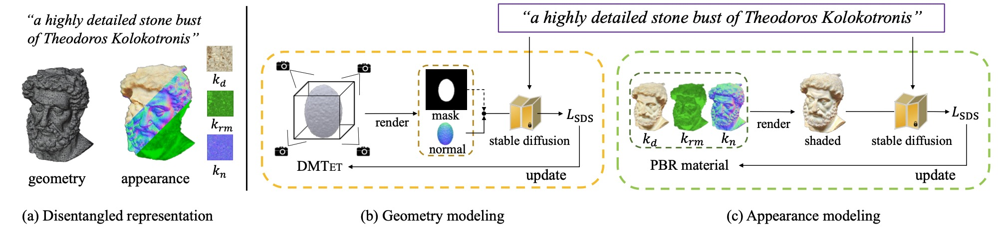

___Fantasia3D: Disentangling Geometry and Appearance for High-quality Text-to-3D Content Creation___  
[Rui Chen*](https://aruichen.github.io/), [Yongwei Chen*](https://cyw-3d.github.io/), __Ningxin Jiao__, [Kui Jia](http://kuijia.site/)
 
\* equal contribution
 
Preprint | [paper](https://arxiv.org/abs/2303.13873) | [Project Page](https://fantasia3d.github.io/) | [Code](https://github.com/Gorilla-Lab-SCUT/Fantasia3D) | [Video](https://www.youtube.com/watch?v=Xbzl4HzFiNo)
